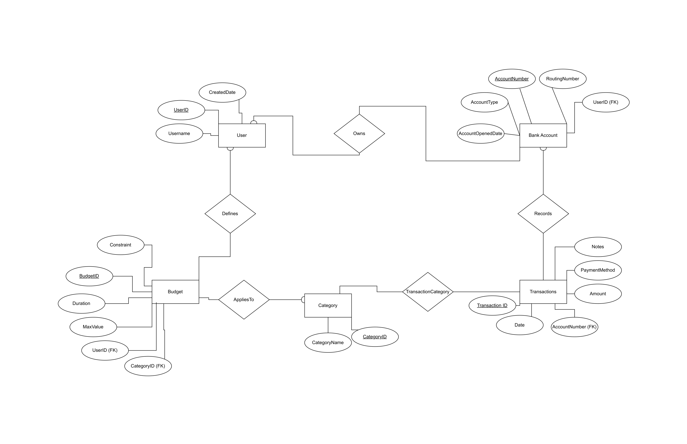

# BizQuery — Personal Finance Tracker

A full-stack web application for tracking personal finances, managing budgets, and visualizing spending trends. Built with Node.js, Express, and MySQL.

## Demo

[▶ Watch Demo Video](https://drive.google.com/file/d/14cpVvqd6FQqI6C9immKDav1Y_8kK5HC_/view?usp=sharing)

---

## Tech Stack

| Layer | Technology |
|---|---|
| Frontend | HTML5, Bootstrap 5, Chart.js |
| Backend | Node.js, Express.js |
| Database | MySQL 8 |
| ORM/Driver | mysql2 |

---

## Features

- **Transaction Management** — Add, delete, and filter transactions by date, amount, payment method, and category
- **Budget Tracking** — Set monthly budget limits per category; real-time over-budget warnings on every transaction insert
- **Data Visualization** — Interactive pie chart of month-to-date spending by category
- **Budget Summary Report** — Stored procedure surfaces per-category spend vs. limit with status (On Track / Warning / Over Budget)
- **Budget Alerts** — DB trigger fires on `TransactionCategory` insert; alerts logged to `BudgetAlerts` table and surfaced in the UI
- **Transaction Archiving** — Stored procedure with cursor iterates old transactions and moves them to `ArchivedTransactions`
- **Category Transfer** — DB transaction (READ COMMITTED isolation) safely re-categorizes a transaction with full rollback support

---

## Database Design



Six normalized tables in **BCNF**:

```
User → BankAccount → Transactions ←→ TransactionCategory ←→ Category
                                                                  ↑
User → Budget ──────────────────────────────────────────────────┘
```

**Additional runtime tables:** `BudgetAlerts`, `ArchivedTransactions`

### Key Design Decisions

- `TransactionCategory` is a junction table enabling many-to-many transactions ↔ categories
- `Budget.Max_Value` protected by a `BEFORE INSERT` trigger that rejects negative values
- `AFTER INSERT` trigger on `TransactionCategory` computes real-time monthly spend and logs alerts
- Two explicit DB transactions with rollback: (1) add transaction + budget check, (2) transfer category with ownership verification

### Indexes (from EXPLAIN ANALYZE benchmarking)

| Index | Table | Columns | Query Cost Reduction |
|---|---|---|---|
| `idx_transactions_date_acc` | Transactions | `(Date, AccountNumber)` | 336 → 207 (38%) |
| `i_bankaccount_user` | BankAccount | `(UserID)` | Consistent across Q2–Q4 |
| `i_tc_categoryid` | TransactionCategory | `(CategoryID)` | Reduces join loops |

---

## Getting Started

### Prerequisites

- Node.js v18+
- MySQL 8.0+

### Setup

```bash
git clone https://github.com/benhug2/fa25-cs411-team007-BizQuery
cd fa25-cs411-team007-BizQuery
npm install
```

Create the database and run the SQL scripts from `/doc`:

```bash
mysql -u root -p < doc/Stage_3_Queries.sql
mysql -u root -p < doc/Stage_4_Checkpoint_2_Queries.sql
```

Update `db.js` with your MySQL credentials:

```js
const db = mysql.createConnection({
  host: 'localhost',
  user: 'your_user',
  password: 'your_password',
  database: 'BizQuery'
});
```

Start the server:

```bash
npm start
# → http://localhost:3000
```

---

## API Endpoints

| Method | Endpoint | Description |
|---|---|---|
| GET | `/api/categories` | List all categories |
| GET | `/api/transactions` | List transactions (supports filters) |
| POST | `/api/transactions` | Add transaction + budget check (DB transaction) |
| DELETE | `/api/transactions/:id` | Delete transaction |
| GET | `/api/budgets` | List budgets |
| POST | `/api/budgets` | Add budget |
| DELETE | `/api/budgets/:id` | Delete budget |
| GET | `/api/monthly-spending` | Month-to-date totals by category |
| GET | `/api/budget-summary` | Stored procedure: budget vs. actual |
| GET | `/api/budget-alerts` | Trigger-generated alerts |
| POST | `/api/archive-transactions` | Stored procedure: archive old transactions |
| POST | `/api/transfer-category` | DB transaction: re-categorize a transaction |

---

## Project Structure

```
├── server.js          # Express routes and API logic
├── db.js              # MySQL connection
├── public/
│   ├── index.html     # Single-page dashboard (5 tabs)
│   └── script.js      # Frontend logic and Chart.js integration
├── doc/
│   ├── Stage_3_Queries.sql               # DDL + data + advanced queries + indexes
│   └── Stage_4_Checkpoint_2_Queries.sql  # Stored procedures, triggers, transactions
└── package.json
```

---

## Team

**My role (Ben Hug):** Database Design & SQL — relational schema, BCNF normalization, stored procedures, triggers, DB transactions, and query optimization via EXPLAIN ANALYZE benchmarking.

| Name | Role |
|---|---|
| Ben Hug | Database Design & SQL |
| Danny Guller | Backend Development |
| Viswanath Vadlamani | Frontend & UI/UX |
| Brandon Lee | Data Visualization & Integration |

University of Illinois Urbana-Champaign — CS 411 Database Systems, Fall 2025
